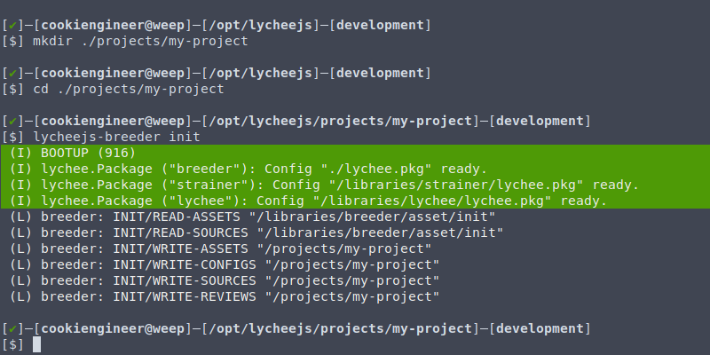
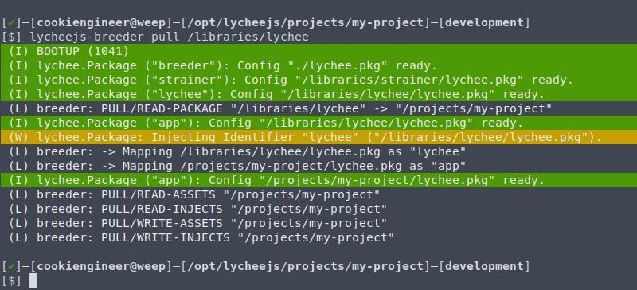
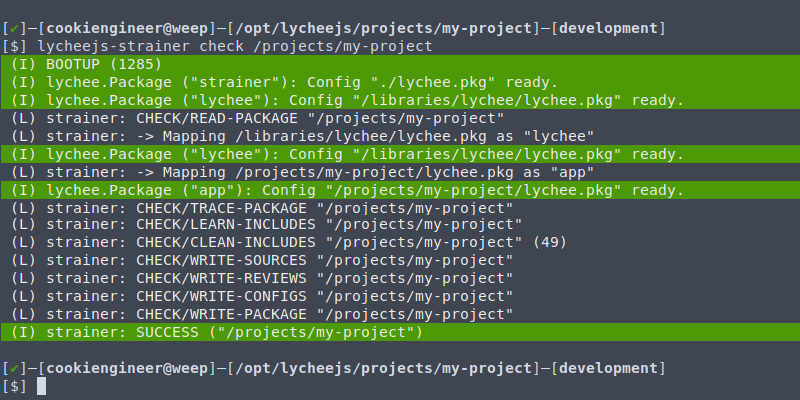

# Workflow

The lychee.js Engine has a specific workflow on
how to create and integrate applications without
manual overhead.

The workflow can be split up in these major phases:

1. Breeding (`init` a project, `pull` a library)
2. Developing (modify a project with your IDE)
3. Fixing (`check` a project)
4. Fertilizing (`configure`, `build`, `package` a project)
5. Publishing (`publish` and `push` a project)


## 1. Breeding Phase

The first phase is the Breeding Phase. In this phase,
it is easier to get started by using the [lychee.js Breeder](../software/lycheejs-breeder.md),
which is a tool that create Projects and Libraries.

```bash
cd /opt/lycheejs;

mkdir ./projects/my-project;
cd ./projects/my-project;

lycheejs-breeder init;                         # init project
lycheejs-breeder init app.net.service.Example; # init definition
```



It is also possible to isolate Libraries into a Project
by using the `pull` action. This allows to have a
standalone Project that is not coupled with the
lychee.js Engine ecosystem.

Every Library is tracked inside a Project's `lychee.pkg`
file. Please read the [Package Format](../project-architecture/Package-Format.md)
Chapter for more details.

```bash
cd /opt/lycheejs/projects/my-project;

lycheejs-breeder pull /libraries/lychee;
```



## 2. Developing Phase

After the Project is initialized, it is best to start
the [lychee.js Harvester](../software/lycheejs-harvester.md),
which integrates all other software bots automatically.

The second phase is the Developing Phase. In this phase,
the codebase of the Project can be changed and freely
modified.

The [lychee.js Strainer](../software/lycheejs-strainer.md)
is run in parallel by the Harvester, so that the code
gets formatted and bugs get fixed while they appear.

```bash
cd /opt/lycheejs;

lycheejs-harvester start development;
```

After the lychee.js Harvester is started with the
`development` profile, the Project's live state
can be seen at [http://localhost:8080/projects/my-project](http://localhost:8080/projects/my-project).

## 3. Fixing Phase

The third phase is the Fixing Phase. In this phase,
the [lychee.js Strainer](../software/lycheejs-strainer.md)
is fixing bugs and mistakes in the Project.

The `check` action of the `lycheejs-strainer`
checks the whole Project.

```bash
cd /opt/lycheejs/projects/my-project;

lycheejs-strainer check /projects/my-project;
```



This phase is somewhat not static, as the
[lycheejs-strainer-fixer](../software/lycheejs-strainer-fixer.md)
CLI command can be integrated into any IDE.

The `lycheejs-strainer-fixer` checks only a single
file and recursively its inclusions or requirements.

```bash
cd /opt/lycheejs/projects/my-project;

lycheejs-strainer-fixer ./source/Main.js;
```


**API Knowledge Data**:

Both the `lycheejs-strainer` and `lycheejs-strainer-fixer`
command will generate the necessary API knowledge data,
which is stored in the `/api` folder of each Project or
Library and has the identical paths as their `/source`
equivalent Definitions.

For example, the API Knowledge for `/source/Main.js`
is stored in `/api/Main.json`.

## 3. Fertilizing Phase

The third phase is the Fertilizing Phase. In this phase
the code will be bundled with binaries and runtimes, so
that the Project can be published to foreign systems.

A so-called `build target` typically consists of a `platform`
and `identifier`, for example `node/dist` and `html-nwjs/main`.

The `dist` and `main` identifier however is reserved for
use with [lychee.js Studio](../software/lycheejs-studio.md),
whereas `dist` has the `variant` set to `library` and
`main` has the `variant` set to `application`.

The [lychee.js Fertilizer](../software/lycheejs-fertilizer.md)
is highly automated and allows to completely build a Project
or Library for dozens of platforms simultaneously.

The `fertilize` action automatically `configure`s, `build`s,
and `package`s a Project depending on its necessary Platform
Adapters.

If a problem occurs, the `lycheejs-fertilizer` command will
output more details with the `--debug` flag.

```bash
cd /opt/lycheejs/projects/my-project;

lycheejs-fertilizer fertilize /projects/my-project; # fertilize project
```


The build process is highly customizable, more details
about the customization possibilities are documented
in the [lychee.js Fertilizer](../software/lycheejs-fertilizer.md)
chapter.

## 4. Publishing Phase

The fourth phase is the Publishing Phase. In this phase
the Project or Library is published to the Peer Cloud
that drives the Artificial Intelligence behind the
lychee.js Engine.

This phase makes the Project or Library publicly
available. Therefore every developer that uses the
lychee.js Engine profits from every other developer
using it.

The `push` action of the [lychee.js Breeder](../software/lycheejs-breeder.md)
eases up this process by providing a step-by-step
wizard.

However, as the Artificial Intelligence is modifying
and improving the codebase, the license will change
according to the license stated in the [README.md](/README.md)
of the lychee.js Engine.

```bash
cd /opt/lycheejs/projects/my-project;

lycheejs-breeder push; # publish project
```

